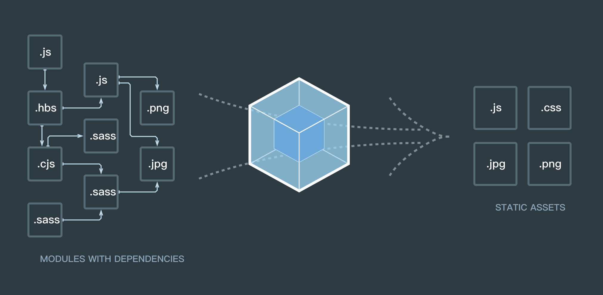

# webpack了解

## 什么是webpack
:::tip
webpack可以看做是模块打包机:它做的事情是，分析你项目的结构，找到javascript模块以及一些浏览器不能直接运行的拓展语言，如scss、less、ts等，并将其打包为合适的格式，可以让浏览器使用。
:::

#### 可以做的事情
::: tip
代码转换、文件优化、代码分割、模块合并、自动刷新、代码校验、自动发布
:::

#### 需要提前掌握的
::: warning
- node基础，npm的使用
- 掌握es6语法
:::