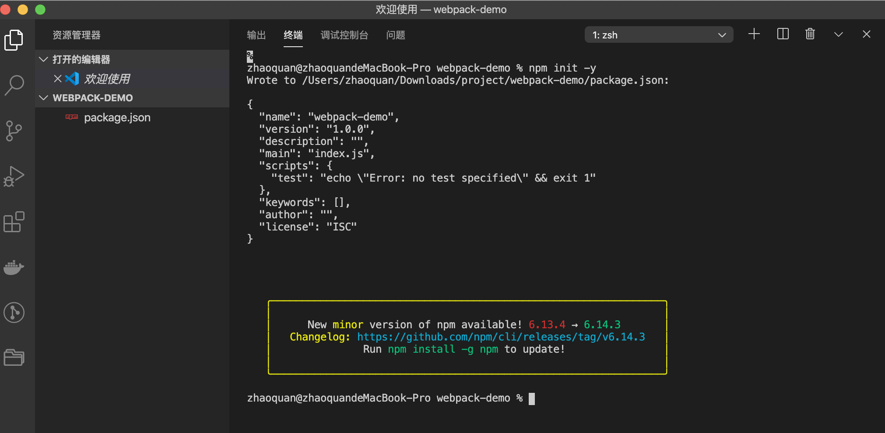
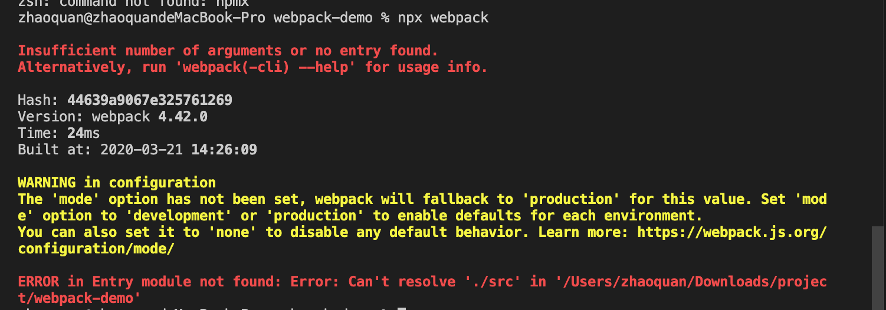
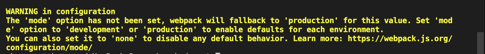

# webpack基础配置

## webpack安装

1. 创建一个空的文件夹，如webpack-demo来练习我们的配置。
2. 首先要符合node的规范，需要一个package.json文件，来对项目进行管理。执行 npm init -y。这个文件描述了我们这个node的项目的一些信息。

3. 安装webpack，有俩种方式，
   1. 全局安装: npm i webpack webpack-cli -g
   2. 项目内安装: npm i webpack webpack-cli --save-dev
::: warning
- 不建议全局安装，因为如果俩个项目，一个项目是使用的是3.0的webpack，一个是4.0的webpack。全局安装的webpack只能兼顾一个版本的项目。
- 项目内安装无法直接使用webpack -v查看webpack版本，使用node提高的npx来查看。
- 如果想具体安装某一个版本的webpack，可使用npm i webpack@4.0,如果我们不知道这个版本是否存在，可以使用npm info webpack查看一下。同 yarn info
- webpack-cli的作用是可以让我们可以在命令行中正确的运行webpack这个命令
:::

## webpack配置

1. 首先我们可以试着直接使用npx webpack

::: warning
这个是因为webpack不知道我们打包的这个项目的入口是什么。默认的配置文件是webpack.config.js,如果有这个文件的话他会找到这个文件，并按照其中的配置打包文件。可以使用npx webpack --config webpackconfig.js让他以其他文件为配置文件。
:::
2. 创建一个webpack.config.js
```js
const path = require('path')
module.exports = {
    entry:'./index.js',//入口
    output:{
        filename:'bundle.js', //打包出的文件的名字
        path:path.resolve(__dirname,'bundle') //打包出口的路径,绝对路径
    }
}
```
3. 配置package.json中的scripts
```js
"scripts": {
    "build": "webpack"
  }
```
::: warning
在scripts中的命令他首先会到当前项目的目录下去找这个命令。
:::

### 打包项目的3种方式
- webpack index.js
- npx webpack index.js
- npm run build


## webpack打包输出内容
```shell
Hash: 1aa671a48a10855d8ab5   #本次打包对应的唯一的一个哈希值
Version: webpack 4.42.0      #webpack的版本
Time: 47ms                   #耗时
# 打包出来的文件    文件大小    chunks放着是对js的id。  chunkName放的是名字
Built at: 2020-03-21 14:44:48   
    Asset       Size  Chunks             Chunk Names
bundle.js  951 bytes       0  [emitted]  main
# 打包入口文件和关联的文件
Entrypoint main = bundle.js
[0] ./src/index.js 21 bytes {0} [built]
```

::: warning
- 缺少模式。production/development
- 默认为production
- 前者会压缩代码，后者不会
:::