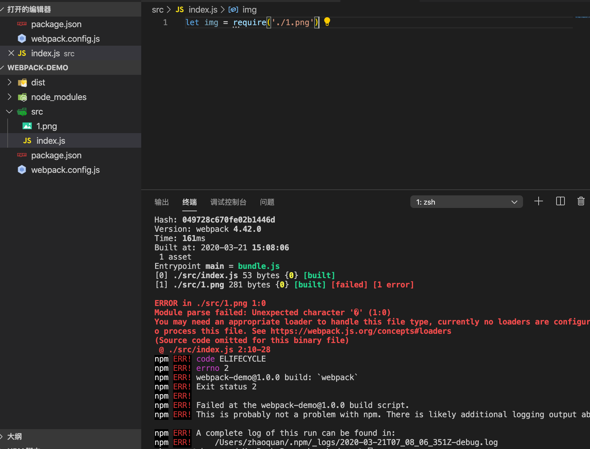
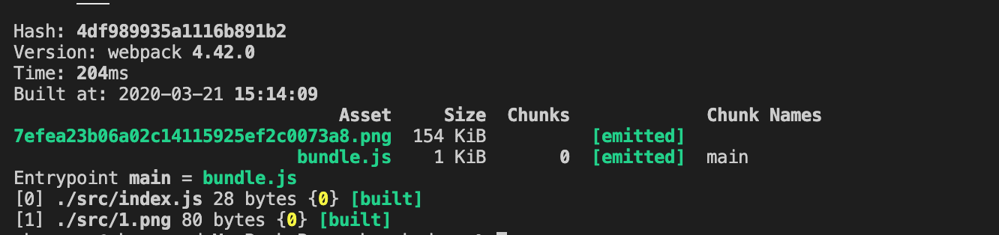

# webpack核心

## 认识loader

::: warning
webpack默认打包js是可以的，打包其他的的呢？
:::


1. 打包模块的时候得改变配置文件，在webpack.config.js中写入module
```js
const path = require('path')
module.exports = {
    mode:'production',
    entry:'./src/index.js',//入口
    output:{
        filename:'bundle.js', //打包出的文件的名字
        path:path.resolve(__dirname,'dist') //打包出口的路径,绝对路径
    },
    module:{
        rules:[
            {
                test:/\.png$/,
                use:{
                    loader:'file-loader'
                }
            },
        ]
    }
}
```
2. 安装loader，npm i file-loader -D
3. 重新进行打包


::: tip
loader是什么
:::